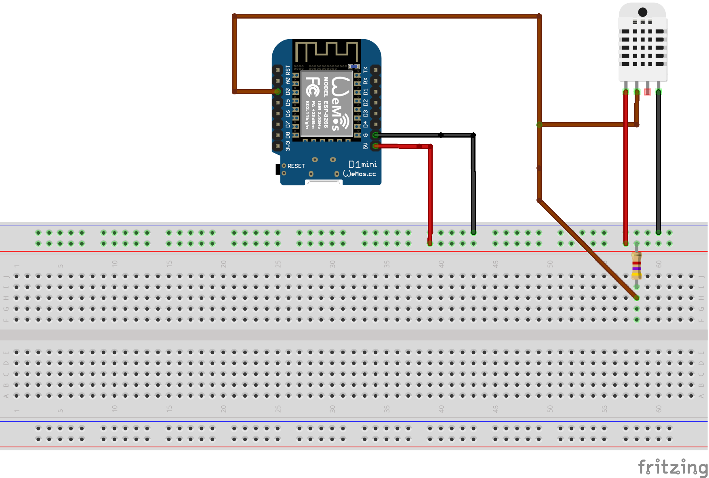
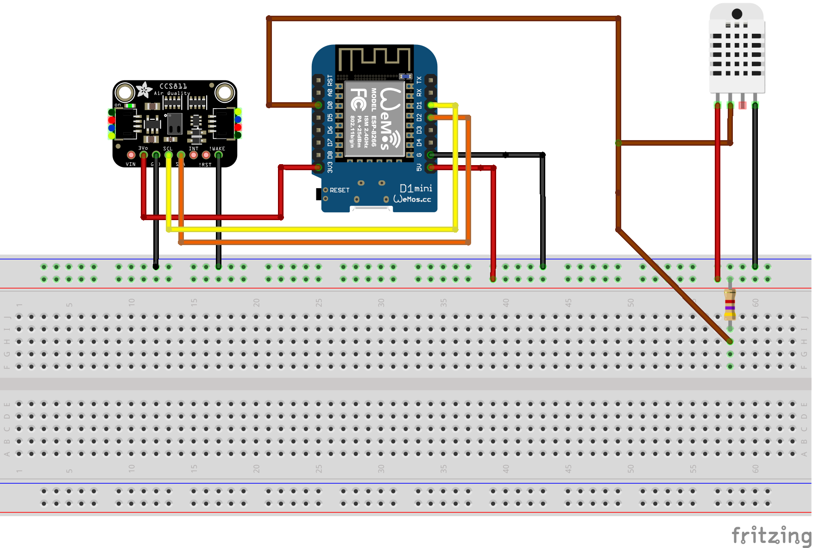

# home weather station
The weather station based on ESP8266 microcontroller (WeMos D1 mini).

## description
The main goal of the project is to make a simple home weather station with additional feature of air-condition monitoring.

## design notes
I chose ESP8266 microcontroller because it has support of WiFi "out of the box", resources enough for my needs (at first sight, 
who knows how the project will grow :) ) and its infrastructure (toolchains, SDK, etc). 

As an environment parameters' sensor I chose DHT22 due to its 1-Wire interface. It is a simple and cheap sensor which 
allow to get the temperature's value of environment in range -40 ... +80 celsius degrees and relative humidity's value
in range 0 ... 100 %. The accuracy of the sensor is not excellent but enough for my purpose. 

To get metrics of air quality I use CCS811 sensor. It's a gas sensor that can detect a wide range of volatile organic 
components (VOC). When connected to microcontroller it return a Total Volatile Organic Compound (TVOC) reading 
and equivalent carbon dioxide reading (eCO2) over I2C.

When the first prototype of monitoring station was ready (see weather station sketch) I decided to put in order 
a little bit my knowledges gained during experiments and make some improvements of the project.

## DHT22
To talk and interact with DHT22 sensor I use the library [DHTesp] (https://github.com/beegee-tokyo/DHTesp) .
It's a fork of [arduino-DHT] (https://github.com/markruys/arduino-DHT) adopted to ESP microcontrollers.

An initial schematic to read temperature and humidity with DHT22 sensor is pictured below.

A one note about wiring diagram. The DHT22 require external pull-up resistor on the data line. I saw few shematics with different
values (anything in the range from 1kOm to 10kOm should work fine). I use a resistor 4.7 kOm as recommended by the manufacturer.
And a few words about the period of sensor's polling. In accordance with datasheet the minimal polling interval is 2 seconds and 
when I dropped an eye into the implementation of DHTesp library I found that it doesn't allow to poll sensor more often. Therefore
in my code I calculate the time-delta between current time and time of the last reading and poll the sensor again only when 
*(currentTime - lastReadingTime ) > minSamplingPeriod.* where the value minSamplingPeriod equals 2 seconds is returned by library.

## CCS811
When I ensured that everyting well with temperature/humidity sensor (DHT22) I started to mess with CCS811 sensor.

Initially I used a library from Adafruit. The code is pretty simple: include library header, create an instance of Adafruit_CCS811
in the global scope, initialize object and set operation mode in setup() routine. The loop() routine polls the sensor with period 
equal to operation mode (60 seconds). To make evaluations more precise, sensor's firmware allows set the environment parameters 
like temeparture and humidity. 

`#include <Adafruit_CCS811.h>`
`...`
`Adafruit_CCS811 ccs811;`
`...`
`void setup() {`
`   ...    `
`   if (!ccs811.begin()) {`
`     Serial.println("Could not initialize CCS811 library!");`
`     while (1) ;`
`   }`
`   ccs811.setDriveMode(CCS811_DRIVE_MODE_60SEC);`
`  ...`
`}`

`void loop() {`
`   ...   `
`    if (!isnan(th.humidity) && !isnan(th.temperature)) {`
`      ccs811.setEnvironmentalData(th.humidity, th.temperature);`
`    }`
`   ...   `
`    if (ccs811.available()) { `
`       uint8_t rc = ccs811.readData(); `
`       if (rc == 0) {
`           uint16_t tvoc = ccs811.getTVOC(); `
`           uint16_t eco2 = ccs811.geteCO2(); `
`       } `
`    } `
`   ...   `
`}`

The wiring connection of sensors to WeMos board as depicted.
 .
