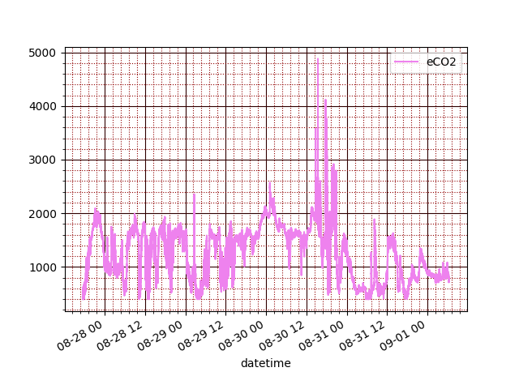

# home weather station
The weather station based on ESP8266 microcontroller (WeMos D1 mini).

## description
The main goal of the project is to make a simple home weather station with additional feature of air-condition monitoring.

The air quality is assessed by measurement of TVOC and CO<sub>2</sub> (estimated value, not the directly measured. see below):

- **Carbon dioxide** (CO<sub>2</sub>), which is measured in parts per million (ppm). In indoor spaces, harmful CO<sub>2</sub> levels begin 
in the 1,000 ppm to 2,000 ppm range, usually due to poor air exchange. Higher CO<sub>2</sub> levels become increasingly harmful. 
When CO<sub>2</sub> levels exceed 40,000 ppm, workers are in immediate harm due to oxygen deprivation.

- **Total volatile organic compounds** (TVOC), which is measured in parts per billion (ppb). TVOC is used to estimate 
the Total Volatile Organic Compounds (VOC) that are present simultaneously in the air, i.e. the sum of VOCs in 
the monitored air. TVOCs generally cover a wide range of different organic substances that are often chemically very similar 
and difficult to distinguish, which has resulted in the development of several different TVOC standards. Detecting TVOC in 
the 220 ppb to 660 ppb range indicate poor ventilation efficiency. Environment with TVOC readings in the 2,200 ppb 
to 5,500 ppb range are considered unhealthy and require intense ventilation.

- **eCO<sub>2</sub>** is directly connnected with VOC measurement. eCO<sub>2</sub> is an estimate of the CO<sub>2</sub> concentration based on the currently 
detected VOC concentration. This estimate is based on the assumption that the VOCs produced by humans are proportional to 
the CO<sub>2</sub> exhaled. The advantage is that the eCO2 output can then be handled in a similar way to the signal from a standard CO<sub>2</sub> 
sensor and the cost of a VOC sensor is lower than that of a CO<sub>2</sub> sensor operating on the optical principle.


## design notes
I chose ESP8266 microcontroller because it has support of WiFi "out of the box", resources enough for my needs (at first sight, 
who knows how the project will grow :) ) and its infrastructure (toolchains, SDK, etc). 

As an environment parameters' sensor I chose DHT22 due to its 1-Wire interface. It is a simple and cheap sensor which 
allow to get the temperature's value of environment in range -40 ... +80 celsius degrees and relative humidity's value
in range 0 ... 100 %. The accuracy of the sensor is not excellent but enough for my purpose. 

To get metrics of air quality I use CCS811 sensor. It's a gas sensor that can detect a wide range of volatile organic 
components (VOC). When connected to microcontroller it return a Total Volatile Organic Compound (TVOC) reading 
and equivalent carbon dioxide reading (eCO<sub>2</sub>) over I2C.


## DHT22
To talk and interact with DHT22 sensor I use the library [DHTesp](https://github.com/beegee-tokyo/DHTesp).
It's a fork of [arduino-DHT](https://github.com/markruys/arduino-DHT) adopted to ESP microcontrollers.

An initial schematic to read temperature and humidity with DHT22 sensor is pictured below


A one note about wiring diagram. The DHT22 require external pull-up resistor on the data line. I saw few shematics with different
values (anything in the range from 1kOm to 10kOm should work fine). I use a resistor 4.7 kOm as recommended by the manufacturer.
And a few words about the period of sensor's polling. In accordance with datasheet the minimal polling interval is 2 seconds and 
when I dropped an eye into the implementation of DHTesp library I found that it doesn't allow to poll sensor more often. Therefore
in my code I calculate the time-delta between current time and time of the last reading and poll the sensor again only when 
*(currentTime - lastReadingTime ) > minSamplingPeriod.* where the value minSamplingPeriod equals 2 seconds is returned by library.

## CCS811
When I ensured that everyting well with temperature/humidity sensor (DHT22) I started to mess with CCS811 sensor.

Initially I used a library from Adafruit. The code is pretty simple: include library header, create an instance of Adafruit_CCS811
in the global scope, initialize object and set operation mode in setup() routine. The loop() routine polls the sensor with period 
equal to operation mode (60 seconds). To make evaluations more precise, sensor's firmware allows set the environment parameters 
like temeparture and humidity. 

```
#include <Adafruit_CCS811.h>
...
Adafruit_CCS811 ccs811;
...
void setup() {
   ...    
   if (!ccs811.begin()) {
     Serial.println("Could not initialize CCS811 library!");
     while (1) ;
   }
   ccs811.setDriveMode(CCS811_DRIVE_MODE_60SEC);
  ...
}

void loop() {
   ...   
    if (!isnan(th.humidity) && !isnan(th.temperature)) {
      ccs811.setEnvironmentalData(th.humidity, th.temperature);
    }
   ...   
    if (ccs811.available()) {
       uint8_t rc = ccs811.readData();
       if (rc == 0) {
           uint16_t tvoc = ccs811.getTVOC();
           uint16_t eco2 = ccs811.geteCO2();
       } 
    } 
   ...   
}
```

The wiring connection of sensors to WeMos board as depicted.


Unfortunatelly after update the board began to fall into constant reboot with stack trace which was dumping into serial monitor window.
I'm going to find the reason of observed problem by debugger but later. To make things forward I tried another CCS811 support library
[Arduino library for CCS811 gas sensor](https://github.com/maarten-pennings/CCS811). The interface to basic functional of the gas sensor
is the same. Haven't explore the internals thorough enough yet, but it works.

The sensor is able to operate in 5 different modes. When don't complicate things they are differ by sampling rate. To choose one of them 
I decided to perform visual analysis of the measurements taken along a week. I made sketch which puts sensor in one of the operation modes, 
takes measurements with a relevant rate and sends data to a logging server via HTTP. The server puts received data into a DB (CSV-file is 
enough for such simple purpose). When the data collection is done they could be visualized with a simple script using matplotlib.
The results is presented in the figures below.

---
###### sampling interval 60s
 
---
###### sampling interval 1s
 

For my point of view the measurements taken with 1s interval and the measurements taken with 60s interval look more or less the same. 
It looks that in a 4 - 5 days measurements become stable (Still difficult to explain some outstanding peaks). Therefore it doesn't really 
matter which sampling period to use. However, the air quality can be assessed very aproximately. 

## WiFi
The WiFi support is provided by the core library [ESP8266WiFi library](https://arduino-esp8266.readthedocs.io/en/latest/esp8266wifi/readme.html).
I've already used it together with HTTP client library [ESP8266HTTPClient](https://github.com/esp8266/Arduino/tree/master/libraries/ESP8266HTTPClient). 
Now it's time to a few details.
The connection to WiFi is initialized by the following
```
WiFi.begin("MY-SSID", "MY-PASSWORD");
```
It's obvious that to change the network (SSID, and/or password) the code have to be recompiled and the binary must be uploaded into Flash memory. 
Not even worth mentioning that hardcoding credentials in source code it's a security flaw. To make managing of WiFi networks/credentials more flexible 
I found a relevant library [WiFiManager](https://github.com/tzapu/WiFiManager). It is well documented so I don't repeat how to use it.

### UPDATE
Some time later I decided to refuse use WiFi manager library for the reasons below:
- it has nothing what I can't implement myself keeping the only needed functional
- its implementation already contains web server which doesn't suit me, because I want to add processing of the 
http requests I need in a simple and understandable way (without having to understand someone else's code and modify it)

#### WiFi modes
Device may operate in two WiFi modes:
- station modem when device connects to known network
- access point mode when device forms its own WiFi network and enables other WiFi devices connect to that network

#### Captive portal
One of the main feature of WiFi manager is captive portal and ability to manage WiFi connection(s) - store connection settings in NVRAM and connect 
automatically to the last known WiFi network.
The main idea of **captive portal** is to give user opportunity to connect to device when that device is not connected to any WiFi network and setup 
connection with any neighbour WiFi network.
WiFi connection parameters are stored in NVRAM and read by device at each start. Then device make attempt to connect to WiFi network using parameters
were read from NVRAM. The atempt of connect is made with station mode (assumed that we are connecting as wireless client to known network). If connection 
failed, device switched to access point mode so that user is abple to connect to device with web browser and setup WiFi connection. When device started 
the first time it knows nothing about WiFi networks nearby, so connection parameters are not valid and connection in station mode is failed. When device 
switched to access point mode and receive http-requst to get default page, it will respond with captive portal page. The page contains list of networks 
available nearby so that user choose one of them and field to input password. After the input data confirmed by user they are stored in NVRAM and after 
rebooting device will try to connect to WiFi network using new connection params (SSID of network and password).

#### WiFi connection
When device started it reads configuration from NVRAM, configuration comprises WiFi connection parameters among others. Initially device make attempt to 
connect to last known network using station mode
```
  WiFi.mode(WIFI_STA);
  delay(200);
  WiFi.begin(settings.ssid, settings.password);
  bool connected = checkWiFiConnection();
```
The function `checkWiFiConnection` check status of connection few times with some time interval and returns immediatelly when connection is up. When check 
of connection failed it means either that saved network is not available anymore or device started first time and connection parameters are not valid. In 
that case device will setup WiFi in the soft access point mode. There are few versions (overloads in terms of C++) of `softAP` method, but the simplest one 
just take network SSID as argument and setup an open WiFi network.
```
    WiFi.mode(WIFI_AP);
    if (!WiFi.softAP(DEVICE_NAME)) {
      Serial.println("Could not setup soft AP!");
      while (1) ;
    }
```

## Web server
No matter device operating in station mode or access point mode, it has to server http-requests (to show captive portal, page with sensors readings, etc).
To made web-server I chose [ESPAsyncWebServer](https://github.com/me-no-dev/ESPAsyncWebServer) library. It documented well and used in many IoT projects. 
Asynchronous web server has many advantages over  synchronous one, the one of them is that web server which processes request in asynchronous fashion 
doesn't blocking the main loop. The ESPAsyncWebServer requires [ESPAsynTCP](https://github.com/me-no-dev/ESPAsyncTCP) as dependency.
Web-server will listen standard HTTP-port 80.
```
#include <ESPAsyncTCP.h>
#include <ESPAsyncWebSrv.h>
...
AsyncWebServer webServer(80);
```
When WiFi connection setup is done, the code of web server initialization run.
```
  initRequestHandlers();
  webServer.begin();
```
The code of the function `initRequestHandlers` is pretty long so I don't put the full content of the function here, just explain what it does because 
it's important. As we may guess from its name the function make setup how different http-requests are handled by web-server. Depending on type of 
http-request (GET or POST, there are some others but we use only these two) and URI the different ways of processing may be requered. Each request 
handler is binded to URI and request type and represents lambda function (in terms of C++). When device operating in access point WiFi mode or station 
mode it uses a few different sets of handlers. For example, the default GET request will be redirected to the main page with sensors data when device 
is connected to WiFi network, but the same request will be redirected to the captive portal page. 
```
  if (wifiMode == WIFI_STA) {
    
    webServer.on("/", HTTP_GET, [](AsyncWebServerRequest *request) {
      request->send(SPIFFS, "/main.html", "text/html");
    });
    ...
    // some others handlers
    ...
  } else if (wifiMode == WIFI_AP) {
   
    webServer.on("/", HTTP_GET, [](AsyncWebServerRequest *request) {
      request->send(SPIFFS, "/wifi_setup.html", "text/html");
    });
    ...
    // some others handlers
    ...
  }
```

## DNS
DNS eliminate the need to memorize IP address of device and enable to connect to device using easy to remember domain name. Indeed user don't know 
the IP address of device after it started and connected to WiFi network or when it run in access point mode and establishes its own WiFi network. 
mDNS is a protocol that allows to make the resolution of locally defined names to IPs without the need for dedicated DNS server. The protocol works 
over multicast UDP. But in order to success name resolution, the client connecting to device also needs to support mDNS (depending on the OS which 
runs client it may be Bounjour service in case of Windows OS and Avahi service in case of Linux).
To start the mDNS resolver its needed to call the `begin` method on an extern variable `MDNS`. This variable is an object of `MDNSResponder`, which 
makes available all the functionality needed for the resolution of addresses. The `begin` method starts the mDNS responder for the given host name 
(in our case device will be accessible via "esp8266.local").

```
#include <ESP8266mDNS.h>
...
// in setup() function
  if (!MDNS.begin("esp8266")) {
    Serial.println("Could not start MDNS responder!\n");
  }
  
// in loop() function
  MDNS.update();
```


## Alarm system
It would be expected that the system which measure the some environmental parameters will alert human in the close nearby when any of the measured 
parameter exceed safe value. For that purpose I made a simple sound alert system. 
To produce sound I chose active (the buzzer has a build-in oscillator) magnetic buzzer operating at 3V. The active buzzer generates a tone using an 
internal oscillator, that creates an alternating voltage signal for the buzzer based on the external DC voltage. Because the oscillator could not be 
changed, the active buzzer can only play a single tone with a predefined frequency when a constant DC voltage is provided. It's enough for a simple 
goal - make alert. Also such design solution has an advantage - no needed code to generate square wave. 
The current consumption of magnetic buzzer is greater than 20 mA. The maximum output current from one GPIO pin of ESP8266 is 12 mA. Therefore it is 
needed another power supply than digital I/O pin of the microcontroler. The solution is to use transistor and divide between the control signal and 
the power consumption. I use PN2222 (which is bipolar junction NPN transistor) as low-side transistor to control the buzzer. I chose NPN transistor 
and low-side configuration because I want that high level on I/O pin will turn sound on and the low level will make buzzer silent.
When the buzzer is switched off the vibration of the magnetic buzzer can lead to voltage spikes because of the self-induction in the coil. The diode, 
also called a flyback diode, that is set in parralel to the buzzer provides a safe path for the inductive current so that the voltage does not rise 
and damage the circuit.

The circuit diagram is depictured below.

--


The full wiring diagram is shown below.

--


#### Buzzer controller
The trivial example of code which control the buzzer imposes delays of various durations into the main loop. That is innacceptible for the real device 
because a lot of time sensible events will be processed by the main loop (ex. HTTP-server, MQTT-client and posiible many others as the project will 
grow). To control the state of buzzer a simple class *BuzzerController* was designed. It provides interface to turn on/off buzzer and set up the 
duration of emitted sound.

#### Hazard events
The device should recognize hazard events and emit alarm when detect any of them. For our system let it be such set:
- a single TVOC reading exceeds a defined threshold
- a single CO<sub>2</sub> reading exceeds a defined threshold
- a sustained CO<sub>2</sub> reading exceeds a defined threshold for a defined length of time

A sustained value is calculated by Time Weighted Average (TWA) method. TWA takes into consideration not only the numerical level of a particular variable, 
but also the amount of time spent on it. TWA calculated as (t<sub>1</sub> $\times$ v<sub>1</sub> + t<sub>2</sub> $\times$ v<sub>2</sub> + ... + t<sub>n</sub> $\times$ v<sub>n</sub>) / (t<sub>1</sub> + t<sub>2</sub> + ... + t<sub>n</sub>) .
Because the values are sampled with the same time  t<sub>1</sub> = t<sub>2</sub> = ... = t<sub>n</sub> = t the formula above becomes 
t $\times$ (v<sub>1</sub> + v<sub>2</sub> + ... + v<sub>n</sub>) / (t $\times$ n) = (v<sub>1</sub> + v<sub>2</sub> + ... + v<sub>n</sub>) / n, i.e. just an averaging the samples during the period n $\times$ t .

**Note:** The idea was seen here [Air quality shield](https://www.ibm.com/docs/en/mwi?topic=shields-air-quality-shield)

The class *AlarmController* is responsible for triggering alarm (a repetitive sound) when any of the monitored parameters (TVOC or CO<sub>2</sub>) exceed the 
defined threshold. The data samples are sent to the class instance and when any of monitored parameters is too large the alarm is turn on and wise 
versa - alarm is turn off when all of the parameters are below their thresholds.

The tracking of single readings is trivial, just compare a given value with defined threshold. Things become a little bit complex when it needed to track 
the sustained value of some monitored parameter. 
To track a sustained value of CO<sub>2</sub> the samples are buffered during 15 min (900 s), then averaged and the result is compared with defined (hardcoded) 
threshold value. The average values are buffered too during 480 min (8 h what is 28800 s) interval. When the interval is passed the values are averaged and 
compared with threshold value (now another) again. 
Thus alarm controller have to be able:
- compare single readings with threshold values and trigger an event when current reading overseeds threshold.
- bufferize CO<sub>2</sub> readings during the short interval (hardcoded 15 min) and average them when interval has passed.
- compare the average value with thresholed value and trigger an event when the average during the short interval overseed threshold.
- bufferize average values during the long interval (hardcoded 8 h), average them when interval has passed and compare the result with threshold. 
in case when result overseed threshold the triggering of event is needed.

The CCS811 sensor is queried with 1 s interval. Its readings are send over network and passed to the instance of AlarmController. That object compare them 
with defined thresholds. The CO<sub>2</sub> values are buffered and averaged when a short and then long time interval has passed. The average values are compared 
with defined thresholds too. When any of the threshold is overseeded the alarm is turned on. 
I don't include into *AlarmController* the measurement of time interval of sampling assuming that sensor's readings arrive every 1 s. The same relates to 
the maximum size of CO<sub>2</sub> samples buffers: their sizes depends on the length of averaging interval and assumption that sampling is done with period of 1 s.


## MQTT
To send data read by sensors required network connection and some protocol to envelope this data into packets to ensure logical grouping and integrity and some 
application layer protocol to transfer these data. While at the initial stage of experiments (when I need to collect sensor readings over several days) I used 
HTTP to transfer information to the logging server, this was a temporary solution, because the main purpose of HTTP is still the transfer of hypertext (suddenly), 
it also works well for REST architectures, but streaming sensor readings is a little different. 
For the purpose to 

I chose MQTT among variety of IoT protocols due to reasons:
- publish/subscribe model of communication. This means that the messages' sender doesn't know nothing about receiver(s). Messages are sent to broker which delivers 
them to recipients interested in receiving this messages. It's flexible and scalable approach, because the publisher (our sending device) communicate to MQTT-broker 
only. 
- widely used in IoT applications. This allows to send data to the public services which provide ability of storing, processing or visualizing of it (ex. ThingSpeak).

I didn't made a deep analysis of MQTT library for ESP8266, just took PubSubClient which is commonly known [pubsubclient](https://github.com/knolleary/pubsubclient) .
For the test purposes I used free public broker (a few links to the list of MQTT brokers for testing are below) and subscriber written on python.

###### MQTT brokers for testing
- [10 free public MQTT brokers](https://mntolia.com/10-free-public-private-mqtt-brokers-for-testing-prototyping/) 
- [popular MQTT brokers for testing](https://www.support.aceautomation.eu/knowledge-base/list-of-popular-mqtt-brokers-for-testing-and-how-to-connect-to-them/) 
